## 構成図




## CDNの独自ドメイン追加とHTTPS化

CloudFrontにも独自ドメインと証明書をつけることができます。

!!! note

    CloudFrontに独自ドメインを使用する場合、SSL証明書が必須となります。  
    https://docs.aws.amazon.com/ja_jp/AmazonCloudFront/latest/DeveloperGuide/CNAMEs.html#alternate-domain-names-requirements  
    また、証明書はバージニア北部リージョンのCertificate Managerに登録されている必要があります。

ドメインと証明書を追加するだけではあるのですが、複数リージョンになるため、修正箇所が増えます。（下記3ファイルを修正します）

1. "lib/wordpress-cdk-stack-us-east-1.ts"

    バージニア北部リージョン用のスタックを新規作成します

    ```typescript title="wordpress-cdk/lib/wordpress-cdk-stack-us-east-1.ts" hl_lines="1 12-15 21-24" linenums="1"
    import { aws_certificatemanager, aws_route53, Stack, StackProps } from "aws-cdk-lib";
    import { Construct } from "constructs";

    export class WordpressCdkUsEast1Stack extends Stack {
        constructor(scope: Construct, id: string, props?: StackProps) {
            super(scope, id, props);

            // *****
            // Route 53
            // *****

            const hostedzone = aws_route53.HostedZone.fromHostedZoneAttributes(this, 'hostedzone', {
                hostedZoneId: 'Z0364500207RRL1KGDBUZ',
                zoneName: 'wordpress-cdk.tk'
            })

            // *****
            // Certificate Manager
            // *****

            const cloudfront_cert = new aws_certificatemanager.Certificate(this, 'cloudfront_cert', {
                domainName: 'www.wordpress-cdk.tk',
                validation: aws_certificatemanager.CertificateValidation.fromDns(hostedzone),
            })
        }
    }
    ```

    * 21-24行目
        * CloudFront用の証明書を作成

2. "bin/wordpress-cdk.ts"

    今まで初期状態から変更しませんでしたが修正します。  
    先に作成したバージニア北部リージョン用のスタックを追加します。

    ```typescript title="wordpress-cdk/bin/wordpress-cdk.ts" hl_lines="5 8-10" linenums="1"
    #!/usr/bin/env node
    import 'source-map-support/register';
    import * as cdk from 'aws-cdk-lib';
    import { WordpressCdkStack } from '../lib/wordpress-cdk-stack';
    import { WordpressCdkUsEast1Stack } from '../lib/wordpress-cdk-stack-us-east-1';

    const app = new cdk.App();
    new WordpressCdkUsEast1Stack(app, 'WordpressCdkUsEast1Stack', {
    env: {region: 'us-east-1'}  
    })

    new WordpressCdkStack(app, 'WordpressCdkStack', {
    /* If you don't specify 'env', this stack will be environment-agnostic.
    * Account/Region-dependent features and context lookups will not work,
    * but a single synthesized template can be deployed anywhere. */

    /* Uncomment the next line to specialize this stack for the AWS Account
    * and Region that are implied by the current CLI configuration. */
    // env: { account: process.env.CDK_DEFAULT_ACCOUNT, region: process.env.CDK_DEFAULT_REGION },

    /* Uncomment the next line if you know exactly what Account and Region you
    * want to deploy the stack to. */
    // env: { account: '123456789012', region: 'us-east-1' },

    /* For more information, see https://docs.aws.amazon.com/cdk/latest/guide/environments.html */
    });
    ```

    * 8-10行目
        * リージョンを明示的に指定し、スタックを作成  

    !!! note

        今までリージョンを指定していませんでしたが、未指定の場合はAWSクレデンシャルに指定したリージョンが使用されます。

3. "lib/wordpress-cdk-stack.ts"
   
    最後にいつものファイルを修正します。

    ```typescript title="wordpress-cdk/lib/wordpress-cdk-stack.ts" linenums="178"
        const cloudfront_cert = new aws_certificatemanager.DnsValidatedCertificate(this, 'cloudfront_cert', {
        hostedZone: hostedzone,
        domainName: 'www.wordpress-cdk.tk',
        region: 'us-east-1'
        })
    ```
    ```typescript hl_lines="10-11" linenums="193"
        const cloudfront = new aws_cloudfront.Distribution(this, 'cloudfront', {
        defaultBehavior: {
            origin: new aws_cloudfront_origins.HttpOrigin("elb.wordpress-cdk.tk"),
            allowedMethods: aws_cloudfront.AllowedMethods.ALLOW_ALL,
            cachedMethods: aws_cloudfront.CachedMethods.CACHE_GET_HEAD_OPTIONS,
            viewerProtocolPolicy: aws_cloudfront.ViewerProtocolPolicy.ALLOW_ALL,
            cachePolicy: aws_cloudfront.CachePolicy.CACHING_OPTIMIZED,
            originRequestPolicy: aws_cloudfront.OriginRequestPolicy.ALL_VIEWER,
        },
        domainNames: ['www.wordpress-cdk.tk'],
        certificate: cloudfront_cert
        })
    ```
    ```typescript linenums="278"
        new aws_route53.ARecord(this, 'cloudfront-domain', {
        zone: hostedzone,
        recordName: 'www',
        target: aws_route53.RecordTarget.fromAlias(new aws_route53_targets.CloudFrontTarget(cloudfront)),
        });
    ```

    * 178-182行目
        * 作成済みの証明書を取得
    * 202-204行目
        * CloudFrontにドメイン名と証明書を指定
    * 278-282行目
        * CloudFrontへのエイリアスのAレコードを作成


## CDK Deploy

すべて修正が終わったら、デプロイします。

バージニア北部リージョンで`bootstrap`を行っていない場合は実施してください。

```terminal title="ターミナル"
cdk bootstrap --region us-east-1
```

バージニア北部リージョン向けのスタックを追加したので、`cdk deploy`時には作成するスタックの指定が必要になります。

```terminal title="ターミナル"
# バージニア北部リージョン向けスタック
cdk deploy WordpressCdkUsEast1Stack
```

```terminal title="ターミナル"
# 東京リージョン向けスタック
cdk deploy WordpressCdkStack
```

!!! note

    すべてのスタックをまとめてデプロイする場合は`cdk deploy --all`でも可能です
