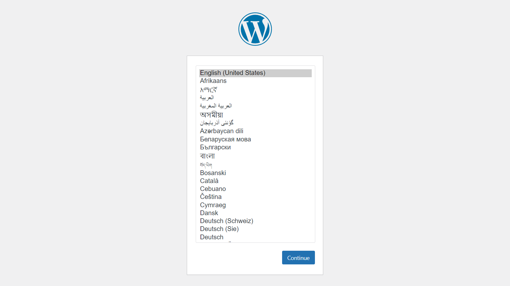
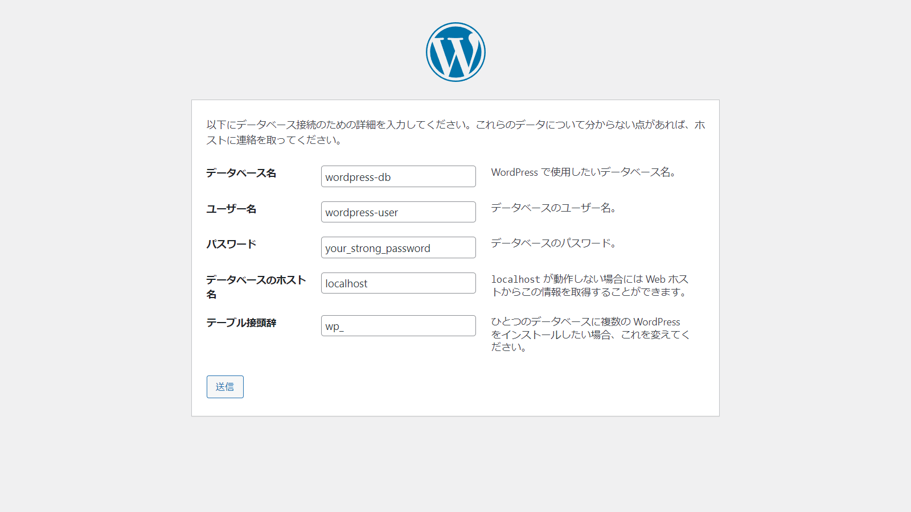

## 構成図


## EC2作成

EC2を作成します。

```typescript title="wordpress-cdk/lib/wordpress-cdk-stack.ts" hl_lines="1 20-23 25-30 32-41 43-45" linenums="1"
import { aws_ec2, aws_iam, CfnOutput, Stack, StackProps } from 'aws-cdk-lib';
import { Construct } from 'constructs';

export class WordpressCdkStack extends Stack {
  constructor(scope: Construct, id: string, props?: StackProps) {
    super(scope, id, props);

    // *****
    // VPC
    // *****

    const vpc = new aws_ec2.Vpc(this, 'VPC', {
      natGateways: 0
    })

    // *****
    // EC2
    // *****

    const ec2_sg = new aws_ec2.SecurityGroup(this, 'ec2-sg', {
      vpc: vpc,
    })
    ec2_sg.addIngressRule(aws_ec2.Peer.anyIpv4(), aws_ec2.Port.tcp(80))

    const ec2_role = new aws_iam.Role(this, 'wordpress-role', {
      assumedBy: new aws_iam.ServicePrincipal('ec2.amazonaws.com'),
      managedPolicies: [
        aws_iam.ManagedPolicy.fromAwsManagedPolicyName('AmazonSSMManagedInstanceCore'),
      ],
    })

    const ec2 = new aws_ec2.Instance(this, 'wordpress', {
      vpc: vpc,
      vpcSubnets: { subnetType: aws_ec2.SubnetType.PUBLIC },
      securityGroup: ec2_sg,

      instanceType: aws_ec2.InstanceType.of(aws_ec2.InstanceClass.T3, aws_ec2.InstanceSize.SMALL),
      machineImage: new aws_ec2.AmazonLinuxImage({ generation: aws_ec2.AmazonLinuxGeneration.AMAZON_LINUX_2 }),

      role: ec2_role,
    })

    new CfnOutput(this, 'ec2-output', {
      value: ec2.instancePublicIp
    })

  }
}
```

* 20-23行目  
    セキュリティグループを作成し、80番ポートを開ける
* 25-30行目  
    セッションマネージャでEC2にアクセスしたいので、IAMロールを追加
* 32-41行目  
    EC2を作成  
    * パブリックサブネットに配置  
    * t3smallインスタンスのAmazon Linux 2

## CDK Deploy

デプロイしましょう。

```terminal title="ターミナル"
cdk deploy
```

簡単ですね :laughing: :laughing: :laughing:

## LAMPのインストール

デプロイが完了したら、Session ManagerでEC2に接続します。  
https://docs.aws.amazon.com/ja_jp/AWSEC2/latest/UserGuide/session-manager.html

セッションマネージャで接続後、こちらを参考にLAMP構成のインストールします。  
https://docs.aws.amazon.com/AWSEC2/latest/UserGuide/ec2-lamp-amazon-linux-2.html

まずは`ec2-user`に切り替えます。

```terminal title="ターミナル"
sh-4.2$ sudo su - ec2-user
[ec2-user@ip-10-0-57-28 ~]$
```

ここからは`ec2-user`で作業します

```terminal title="Apache/MariaDB/PHPのインストール"
sudo yum update -y
sudo amazon-linux-extras install -y lamp-mariadb10.2-php7.2 php7.2
sudo yum install -y httpd mariadb-server
```

```terminal title="Apacheの起動"
sudo systemctl enable httpd
sudo systemctl start httpd
```

```terminal title="MariaDBの起動"
sudo systemctl enable mariadb
sudo systemctl start mariadb
```

```terminal title="MariaDBの初期設定"
sudo mysql_secure_installation
```
```
NOTE: RUNNING ALL PARTS OF THIS SCRIPT IS RECOMMENDED FOR ALL MariaDB
      SERVERS IN PRODUCTION USE!  PLEASE READ EACH STEP CAREFULLY!

In order to log into MariaDB to secure it, we'll need the current
password for the root user.  If you've just installed MariaDB, and
you haven't set the root password yet, the password will be blank,
so you should just press enter here.

Enter current password for root (enter for none): [初期状態ではパスワードが未設定のため、空欄でエンター]
OK, successfully used password, moving on...

Setting the root password ensures that nobody can log into the MariaDB
root user without the proper authorisation.

Set root password? [Y/n] Y
New password: [パスワードを入力]
Re-enter new password: [パスワードを入力]
Password updated successfully!
Reloading privilege tables..
 ... Success!


By default, a MariaDB installation has an anonymous user, allowing anyone
to log into MariaDB without having to have a user account created for
them.  This is intended only for testing, and to make the installation
go a bit smoother.  You should remove them before moving into a
production environment.

Remove anonymous users? [Y/n] Y
 ... Success!

Normally, root should only be allowed to connect from 'localhost'.  This
ensures that someone cannot guess at the root password from the network.

Disallow root login remotely? [Y/n] Y
 ... Success!

By default, MariaDB comes with a database named 'test' that anyone can
access.  This is also intended only for testing, and should be removed
before moving into a production environment.

Remove test database and access to it? [Y/n] Y
 - Dropping test database...
 ... Success!
 - Removing privileges on test database...
 ... Success!

Reloading the privilege tables will ensure that all changes made so far
will take effect immediately.

Reload privilege tables now? [Y/n] Y
 ... Success!

Cleaning up...

All done!  If you've completed all of the above steps, your MariaDB
installation should now be secure.

Thanks for using MariaDB!
```

## WordPressのインストール

WordPressのインストールはこちらを参考にします。
https://docs.aws.amazon.com/AWSEC2/latest/UserGuide/hosting-wordpress.html

```terminal title="WordPressの取得"
wget https://wordpress.org/latest.tar.gz
tar -xzf latest.tar.gz
```

```terminal title="MariaDBのユーザーを作成"
mysql -u root -p
```

```sql
CREATE USER 'wordpress-user'@'localhost' IDENTIFIED BY 'your_strong_password';
CREATE DATABASE `wordpress-db`;
GRANT ALL PRIVILEGES ON `wordpress-db`.* TO "wordpress-user"@"localhost";
FLUSH PRIVILEGES;
exit;
```

!!! danger

    ユーザー名やパスワード、データベース名は適宜修正してください。


```terminal title="Wordpressのインストール"
sudo cp -r wordpress/* /var/www/html/
sudo chown -R apache /var/www
sudo chgrp -R apache /var/www
sudo chmod 2775 /var/www
find /var/www -type d -exec sudo chmod 2775 {} \;
find /var/www -type f -exec sudo chmod 0644 {} \;
```

この先はEC2のパブリックIPアドレスにアクセスし、ブラウザから行います。





ここから先は本題ではないので省略します。

これで、1台のEC2でのWordpress環境の構築ができました。

## ソースコード

??? abstract "ソースコード"

    ```typescript title="wordpress-cdk/lib/wordpress-cdk-stack.ts"
    --8<-- "step/2_ec2/lib/wordpress-cdk-stack.ts"
    ```
