AWSの設定を行っただけではcssやjsのファイルが`http`指定のまま残ってしまい、いわゆる`Mixed content(混在コンテンツ)`の状態となります。

!!! note

    混在コンテンツの危険性や詳細についてはこちらを参照ください。  
    [混在コンテンツのブロック | Firefox ヘルプ ](https://support.mozilla.org/ja/kb/mixed-content-blocking-firefox) 

WordPressのプラグインを使い、HTTPS対応を行います。

## WordPressの初期設定

1. `http://[ELBにセットしたドメイン名]`に接続  
   ここではまだhttpでアクセスします。
    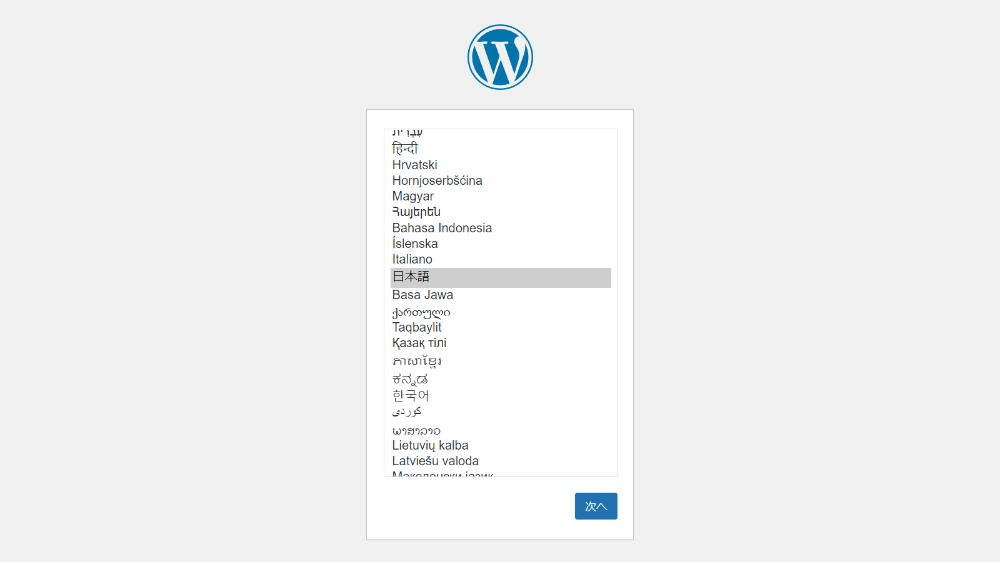
2. WordPressの初期設定を進めます
    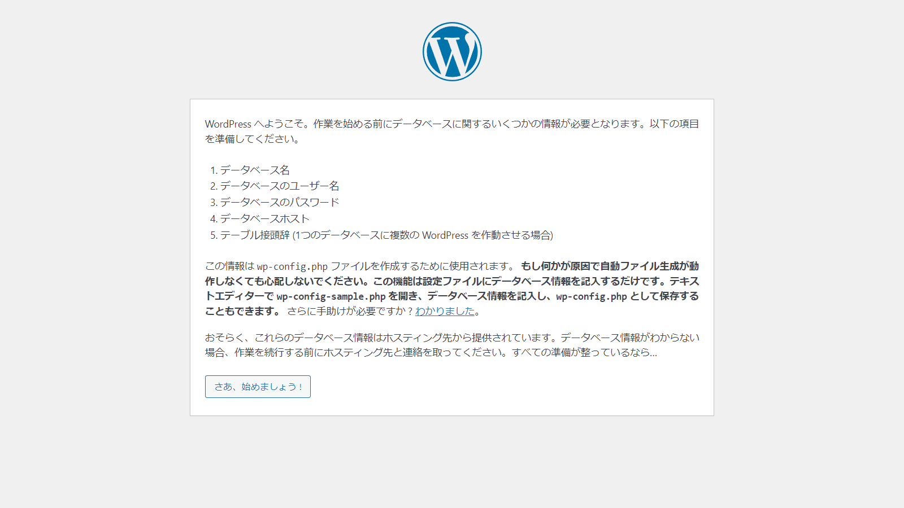
    RDSの認証情報を入力します
    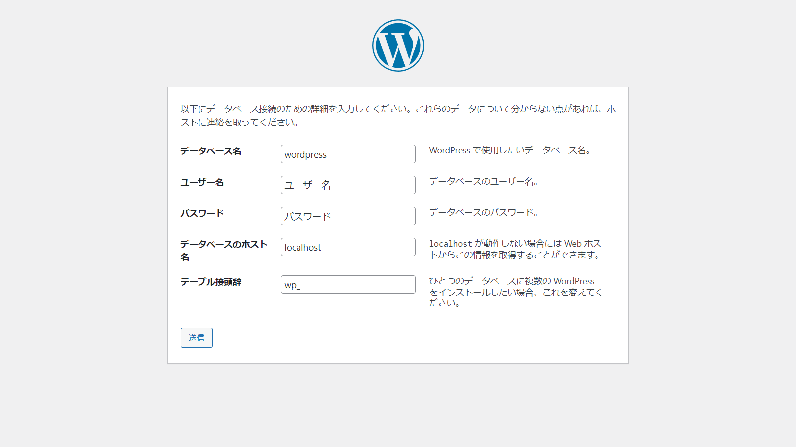
    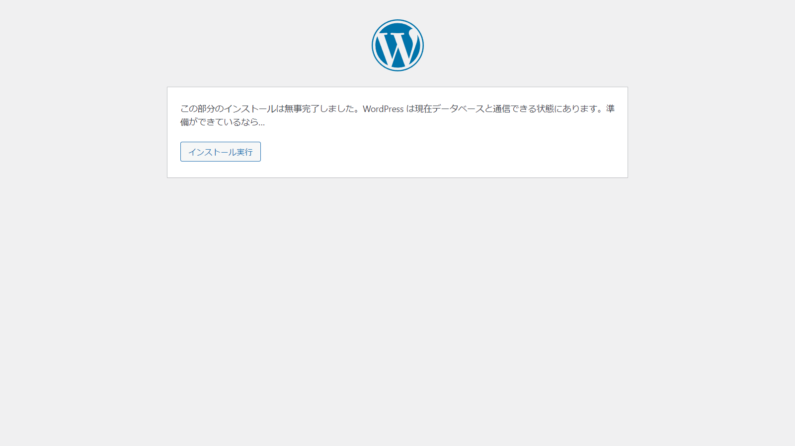
    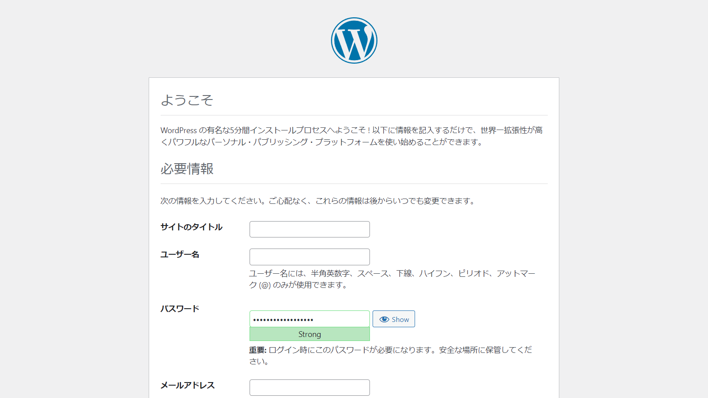
    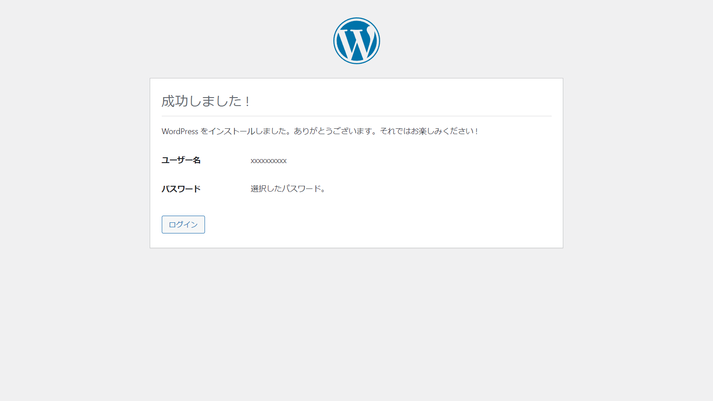

## プラグインのインストールと有効化

3. 初期設定が終わったら、ログインします
    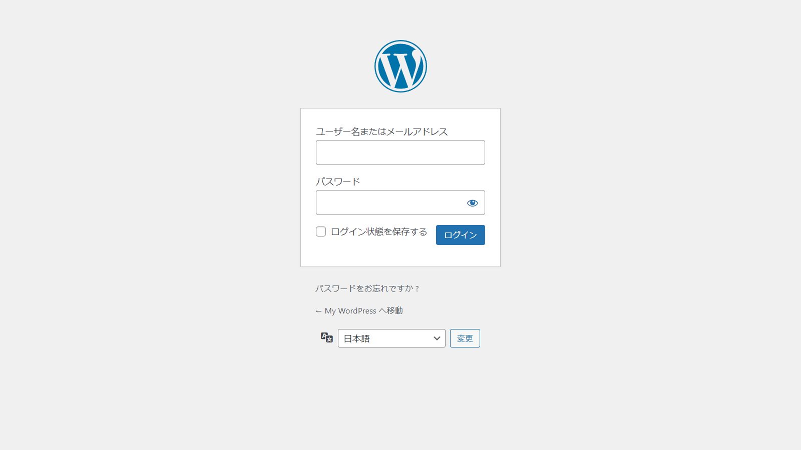
    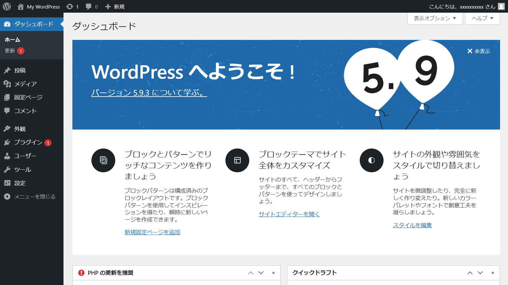
4. `Really Simple SSL`というプラグインをインストールします
    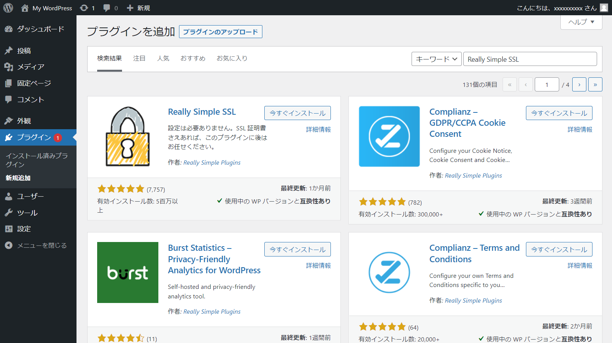
5. 有効化します
    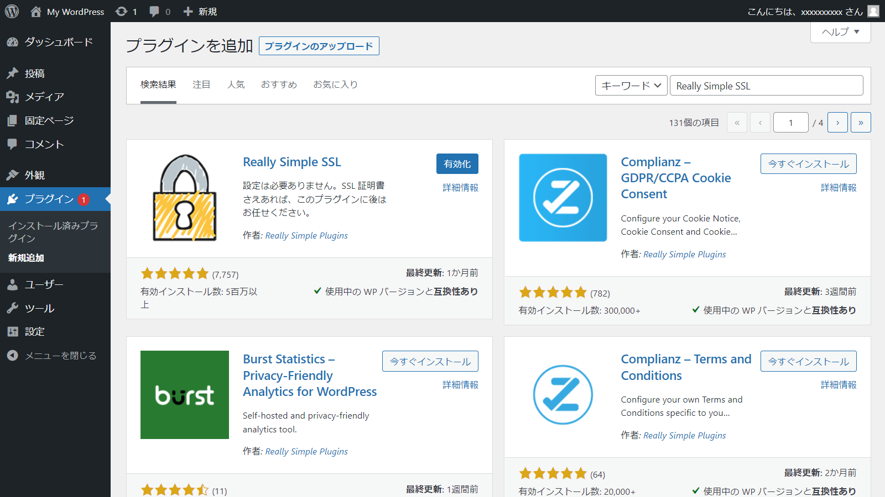
6. `SSLを有効化`ボタンをクリックします
    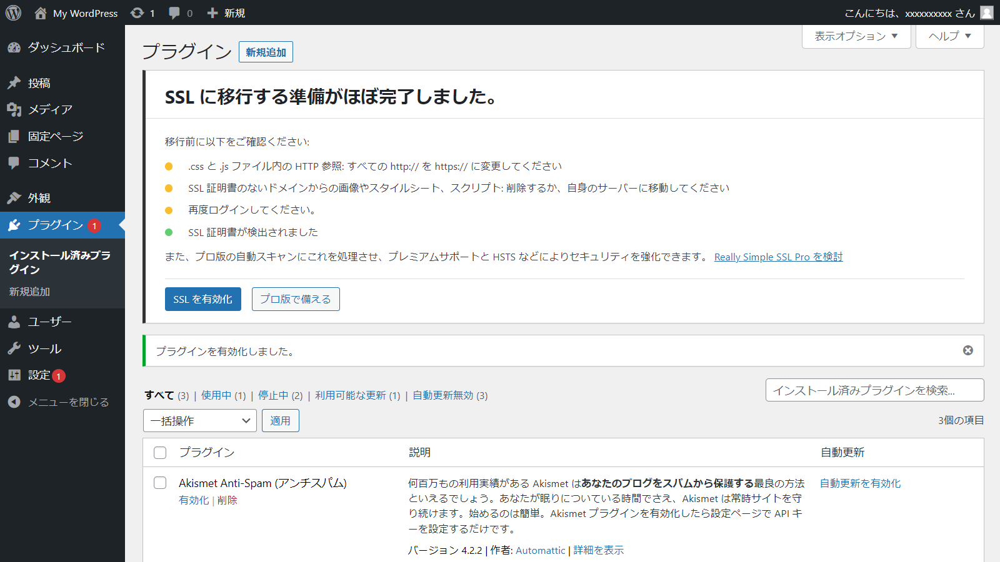
7. 設定が終わるとログイン画面に遷移します
    

以上で設定は完了です。`https`でアクセスできることを確認してください。